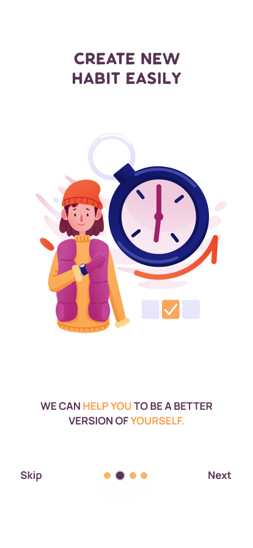
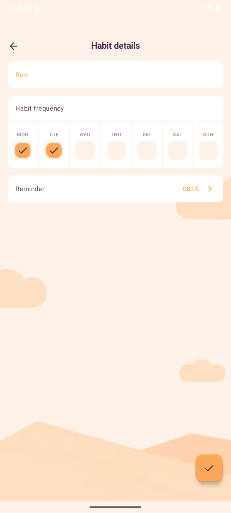

# 🧠 Habix

**Habix** is an Android habit-tracking application built with **Kotlin** and a modern, scalable architecture.  
Its main goal is to help users create, manage, and track daily habits through a clean and intuitive user experience.

The project is designed as a **learning-oriented but production-ready codebase**, following Android best practices.

## 📷 Screenshots

  
  
  
  

---

## ✨ Features

✔️ User onboarding flow  
✔️ User authentication  
✔️ Habit creation and management  
✔️ Feature-based modular architecture  

> Each feature is isolated in its own module to improve scalability, maintainability, and testability.

---

## 📦 Modules

- **app**  
  Entry point of the application and global app configuration.

- **onboarding**  
  Handles the user onboarding flow and first-time experience.

- **authentication**  
  Manages login, registration, and user session logic.

- **habits**  
  Core feature module responsible for habit creation, tracking, and management.

- **settings**  
  User preferences, customization, and configuration.

- **core**  
  Shared components, utilities, base classes, and common abstractions used across modules.

---

## 🛠️ Technologies

- **Kotlin**
- **Jetpack Compose**
- **MVVM Architecture**
- **Clean Architecture principles**
- **Coroutines & Flow**
- **Dependency Injection Hilt**
- **Room (Local persistence)**
